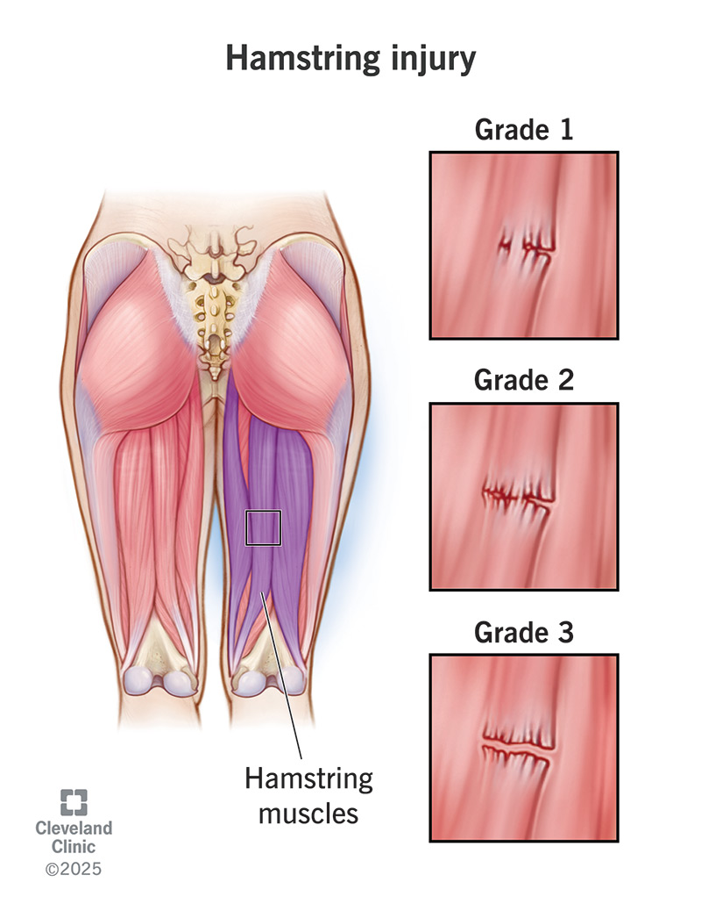
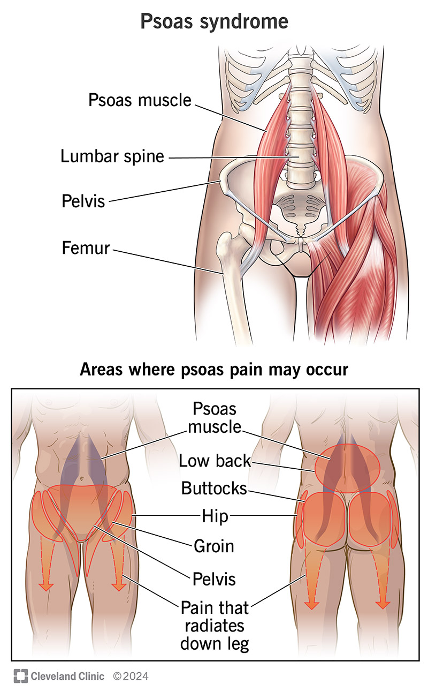
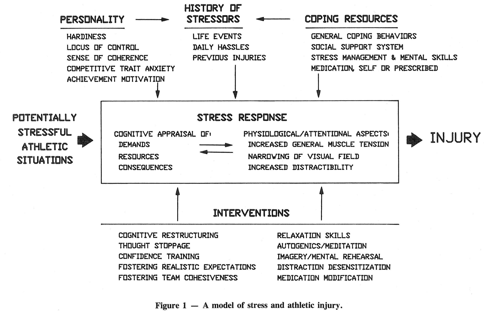
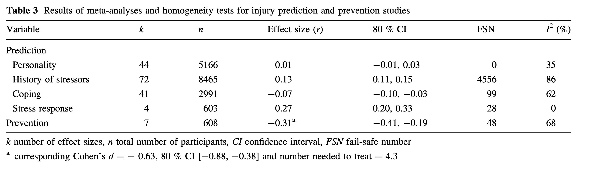

_Photo: Apr 2, 2026; Oklahoma City, Oklahoma, USA; Los Angeles Lakers guard Luka Doncic (77) walks across the court during the first quarter against the Oklahoma City Thunder at Paycom Center. Mandatory Credit: Alonzo Adams-Imagn Images_

## The Injury

I recently saw this guy on Instagram Reels, Stefan Duvivier or [@airduvi](https://www.instagram.com/airduvi). His LinkedIn bio says that he is a "Movement Coach" and high jumper. He was talking about Luka Doncic, the professional basketball player for the LA Lakers, who recently suffered a season-ending hamstring injury during a game (grade 2 strain, or partial muscle tear). The hot take? That Luka's injury had much less to do with how many minutes he was playing on the court, and **much more to do with the amount of stress he was experiencing off the court.** 

Luka is currently one of the most valuable athletes in the entire NBA, having recently signed a $165 million dollar contract for 3 years. He has access to some of the very best doctors, physios, athletic trainers and coaches from around the world, not to mention equipment and treatments and facilities. He has been in prime physical condition, losing more than 20 lbs last summer. However, despite all that going for him, his body was _still_ breaking down, and [repeatedly](https://www.flashscore.ca/player/doncic-luka/pQ4ZBK0o/injury-history/). All at just 27 years old, at a time when LeBron, who is 14 years his senior, is still thriving in his 22nd season. So what gives?

Maybe it's just plain old bad luck. Sometimes the stars don't align. Or maybe it has something to do with Luka's whole world flipping upside down in the past year.

## The Stressors

He was traded from the Dallas Mavericks back in February 2025 in a trade he didn't see coming. His partner of 10 years and fiancée leaves in May back to Slovenia and takes their daughter with her. His second daughter is born in December, and apparently the police were called during a disagreement at the hospital. He then returned to the US on his own and since then has called off the engagement and is now embroiled in a bitter and very public custody battle over the two kids, who he hasn't even seen since December. 

Maybe his nervous system was activated in 'fight or flight mode', Stefan posits. As a result, maybe his deep hip flexors including his psoas muscles were chronically tense and tilted his pelvis forward, lengthening his hamstrings and putting them at a higher risk of injury at baseline. Maybe they've been building up tension with every step he took, until a big enough disruption finally overwhelmed the ability of the muscle fibres to keep it all together, and the muscle tore. 

 


"Your hamstring doesn't just randomly tear. It tears because the tissue has been under siege for months from a nervous system that never got to calm down."


Stefan argues that in chronic states of stress, cortisol is elevated, muscles are more tense and slower to recover, and that no amount of physiotherapy or adjustments or exercises are going to resolve the injury until the underlying cause is addressed and dealt with. 


"When the nervous system doesn't feel safe, when the ground underneath your life is unstable, the [muscles] grip and try to create stability that the rest of the system up top can't provide for you."


When I heard this, I was quite struck by how powerful, poetic, and _intuitive_ this felt. 

## The Research

This is not a new idea. These two sports psychology researchers from the University of Arizona wrote a landmark paper all the way back in 1988 called ["A Model of Stress and Athletic Injury: Prediction and Prevention"](https://pubmed.ncbi.nlm.nih.gov/10521004/), and this is also now known as the "Williams and Anderson model". 

This diagram from the original paper summarizes it well: when there is a potentially stressful event for an athlete, there is first a "stress response" -- that is influenced by non-physical factors like personality, history of stressors, and coping resources, and modulated by interventions --> resulting in increased muscle tension, narrowing of the visual field, and increased distractibility --> that finally then leads to a physical injury. 

Of note, this was largely a _theory_, a framework of hypotheses for future research direction rather than actual cold, hard, empirical data. Decades later, we have slightly more research to back this up, but overall still not a lot compared to, for example, research in cardiology.

Stefan cited in his video a paper published in 2024 called ["50 Years of Research on the Psychology of Sport Injury: A Consensus Statement"](https://link.springer.com/article/10.1007/s40279-024-02045-w) that nicely summarizes the field of the psychology of sport injury over the past half-century. Seven experts from across the globe (one of whom was Canadian) came together to review the literature, and collectively had "over 130 years of academic experience, and over 150 peer reviewed publications, book
chapters and books on the psychological aspects of sport
injury" -- certainly quite impressive. They broke it down into three domains: risk factors for sport injuries (both acute and overuse injuries), rehabilitation after sport injury, and return to sport, and also came up with some recommendations for applied practice of these principles for athletes, coaches, and sports medicine practitioners. 

I took a deeper dive into the research on psychosocial risk factors for acute sports injuries, which highlighted a 2016 systematic review and meta analysis titled ["Psychosocial Factors and Sport Injuries: Meta-analyses for Prediction and Prevention"](https://link.springer.com/article/10.1007/s40279-016-0578-x). The study references the Williams and Anderson model and refers to it as a "path model" (A affects B affects C, as opposed to direct correlation A causes B), and essentially tries to find some hard numbers to support the model. 

The researchers took 48 published studies that looked at psychosocial factors and injury rates, and found that the predictors with the strongest association with injury rates was **stress response** (r=0.27) and history of stressors (r=0.13). 

In psychology, r values between 0.2-0.3 are considered medium-to-large effect sizes, and between 0.1-0.2 considered small-to-medium. Other factors upstream in the path, like coping and personality traits, had much smaller and almost negligible effect sizes (r=-0.07, and 0.01 respectively), although this to me is still encouraging, because it's a lot easier to do mindfulness meditation than it is to change your entire personality or coping mechanisms. 

Overall they found that the path model as a whole explained about 7% of the variance in injury occurrence, suggesting that 93% is explained by other things, such as biomechanics, training load, sport type, and bad luck. So while a stress response may have a medium to large effect on whether you get injured, it certainly doesn't explain everything. Looking at the numbers directly, it seems like there were only 4 studies that actually measured stress response, probably because it is so multifactorial and difficult to measure. One of these was a [2007 study by Swanik et al](https://pubmed.ncbi.nlm.nih.gov/17369562/), which looked at whether athletes who suffered noncontact ACL injuries had decreased baseline neurocognitive performance, that might suggest loss of neuromuscular control and higher stress response. The computer test that was used tested verbal memory, visual memory, reaction time, and processing speed. Unsurprisingly, the athletes who had ACL injuries had significantly worse performance on all of the above categories (p = 0.045 or lower).

What is perhaps more interesting is that psychosocial interventions studied (such as stress management), was associated with fewer injuries (r=-0.31), which corresponded to an equivalent **number needed to treat (NNT) of 4.3**. This means that for roughly every 4 athletes who go through a stress management or mindfulness-based program, one injury that would have otherwise happened could have been prevented. That being said, there were only 7 studies included that looked at preventative interventions. These ranged from 25 to 120 minute sessions spanning 4 weeks to 1 year in duration, and covered cognitive behavioural content such as self-regulation techniques, stress management, relaxation, goal setting, self-confidence, cognitive thought stopping, imagery, mindfulness, and emotion control. Populations studied included soccer players, gymnasts, rugby players, football players, and even ballet dancers. 

## The Mechanisms of Injury 

OK, but why exactly did Luka's hamstring tear, and how much of that really was due to life stress? We don't and likely will never fully know. The authors of the meta analysis propose that strong stress responses are likely to reduce an athlete's decision making capacities and leave them more vulnerable to errors, collisions, and compromised motor control, which is supported by the findings of neurocognitive testing such as described in the Swanik paper. Although not mentioned in the 50 Years consensus statement, we also know from [other studies](https://pubmed.ncbi.nlm.nih.gov/14977244/) that stress responses (namely life-event stress and hardiness) are associated with peripheral vision narrowing (basically tunnel vision), which may decrease an athlete's in-game awareness. 

Stefan also mentioned decreased proprioception (the body's sense of its own position in space) due to stress, although I wasn't able to find any literature on this. The reality is probably multifactorial and complex, and may even involve factors we haven't even thought of. The expert researchers say this under future directions for research, looking ahead to the next 50 years: 


"We also advocate moving beyond traditional biopsychosocial approaches to sport injury, to include a nuanced understanding of institutional (physical environment, psychosocial architecture), socio-cultural (e.g. norms, collective values, cultural narratives) and policy (e.g. national, governing sport-body policies) level factors."


What we do know is this: that athletes who are well supported by their coaches and teams, who are well-rested and get good quality sleep, and are in a social environment and culture where they feel safe reaching out for help rather than a culture of risk and playing through pain and injury, those athletes are less likely to get injured. 

What we also know is that athletes who are motivated, have less fear of reinjury, and adhere to recovery regimens are the most likely to rehabilitate after an injury to pre-injury functioning and ultimately return to sport and competition. Individual factors are certainly at play, as athletes who have severe pain catastrophizing, a strong athletic identity, or perfectionistic tendencies tend to have prolonged and more distressing rehabilitation. Mindfulness, acceptance-based practices and cognitive behavioural therapy all help, as does gratefulness, as exemplified by my personal favourite player, [Nikola Jokić](https://www.reddit.com/r/nba/comments/1maurg9/jokic_winning_the_finals_compared_to_him_winning/).

I found this passage about perceptions around re-injury super interesting and a good example of the mind-body connection:


"Re-injury concerns typically involve reductions in perceived competence (e.g. ‘I’m no longer sure my body can handle the demands of competitive sport or if I get re-injured it will be even more difficult to attain desired levels of athletic proficiency’), autonomy (e.g. ‘I no longer feel in control of my body’s ability to stay healthy or to avoid re-injury’) and relatedness (e.g., ‘If I get re-injured I’ll once again be removed from the sport environment and people I care about and/or who reinforce my identity as an athlete’). Re-injury concerns delay or prevent a return to sport, increase attentional distraction, and negatively affect athletes’ post-injury performances."


## My Own Back Pain

I've always been interested in stuff like this, like how trauma shows up in the body and mind with the writings of Gabor Maté and  Bessel van der Kolk, but also the idea of the mind-gut axis and IBS, or how the brain perceives pain in complex regional pain syndrome or fibromyalgia. Take the idea of total pain in palliative medicine: how stressors, existential suffering, anxiety, and mood can all modulate the (very real) physical pain that we experience, and which aren't always fully treated with pain meds and pharmacology alone. 

Watching Stefan's video and learning about Luka's life stresses made me think about my own chronic back pain. It all started in undergrad, first year of college. I was on the varsity novice men's rowing team, which is a development team for people who haven't rowed before. I was the weakest guy who barely made it on the team from tryouts, after some other guy got injured. The guys on the team were all these high level athletes in other sports like track and field or volleyball who wanted to try rowing, and from the beginning, I always felt like I had to prove myself, to get stronger and (literally) pull my weight on the boat. 

We had morning practices on the water at 5AM three or four times a week, which I wasn't entirely unused to from doing competitive swimming as a kid growing up at the club level, but combined with living away from home for the first time, keeping up with my medical science courses, and navigating a college social life, my nervous system was overwhelmed, even though I might not have known this at the time. 

I weighed 150lbs (at the time lol) and I was told by coach that I needed to gain 20 or 30lb ideally, which despite all the late night snacks available on campus, I could never really do. So there I was, an insecure 18 year old kid trying to literally become someone else, bulk up and become stronger to earn my place on the team and be respected on a team I felt like I didn't belong on, to forge an identity that I didn't have. So I did the only thing I knew how to, which is to put my head down, and pull harder. I remember once I collapsed off the erg (rowing machine) after a tough workout, limped to the trash can nearby, and barely made it to puke my guts out. Another time, I had popped a blister on my thumb from pulling the oar so hard, and only realized when I noticed a blood stain on my shirt. At team huddle I brought this up and remarked that the bloodstain looked a bit too low and that I should be pulling a bit higher toward my chest instead, and everyone laughed. 

<iframe src="https://player.vimeo.com/video/1180145089?badge=0&amp;autopause=0&amp;player_id=0&amp;app_id=58479" frameborder="0" allow="autoplay; fullscreen; picture-in-picture; clipboard-write; encrypted-media; web-share" referrerpolicy="strict-origin-when-cross-origin" style="position:absolute;top:0;left:0;width:100%;height:100%;" title="Rowing Video"></iframe>

_UWO Men's Novice Team - on the water practice. I am in the 7th seat, and yes Coach is telling me to reach more_

And thus the back pain started. I'm sure there are a million other factors at play, such as the amount of time I spend sitting at a desk at work, my poor posture, and how I have a relatively long torso and short legs. But after dozens of massages, physio appointments, cable pull workouts, and even dry needling, what I can tell you is that I can't remember the last time I didn't have back pain. 

And I'm not complaining. Sure, on some days it is really bad and majorly sucks, but overall it's manageable, and I know I'm hardly the first person in history to complain about back pain. 

I also don't regret signing up for rowing at all, because I got to experience one of the best feelings in the world: sliding along the calm surface of the water, the sun just rising, birds flying by, the refreshing cool autumn breeze in your face, and the sound of 8 guys (and a girl coxie) sitting in silence, breathing in unison, and the feeling that anything was possible. 

Would it have been nice to have that without lifelong back pain? Of course. But I have to be optimistic, and grateful. Because according to the research, that will give me the best chance of recovery.
